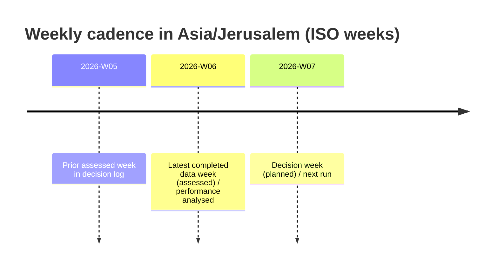

# Weekly Facebook ads processing report

## Executive summary

All eight required inputs are present in the workspace and are machine‑readable (CSVs parse cleanly; JSON loads; TAR opens and contains the manifest-listed files; the markdown log reads). On that basis, the weekly processing can proceed.

Two prerequisite governance files referenced by your process—`data_schema.md` and `decision_log_format.md`—are **not present in the uploaded set** (and are not available in the workspace). As requested, they are treated as **unspecified**, which reduces certainty about canonical column semantics and the exact required decision‑log heading template. I therefore (a) infer table grain from observed columns, (b) keep all week identification explicit and reproducible, and (c) generate the decision‑log entry using the heading structure you specified in your prompt.

Week disambiguation is **unambiguous** given the current date (**2026‑02‑11, Asia/Jerusalem**) and the maximum ISO week present in `ad_weekly_performance.csv`. The latest completed data week (assessed) is **2026‑W06** and the planned decision week is **2026‑W07**, using ISO week boundaries (weeks start Monday; end Sunday). citeturn0search2

Performance in **2026‑W06** shows four ads with spend: two “Men” and two “Women”. Keep rules retain three ads (**Mens Ad J**, **Mens Ad O**, **W 2026‑W06 2**) and replace one (**W 2026‑W06 1**). The replacement recommended is **Womens Ad A** as a “previously used ad” (historical winner; components are strong at meaningful spend; no component overlap within the women’s campaign for the planned week).

A reporting lag is not specified in your artefacts; I assume no imposed constraint but recommend operationally assessing a week **48–72 hours after week end** because Meta’s reporting/attribution windows can cause late-arriving conversions and metric updates. citeturn0search0turn0search9turn0search12

## Input verification and prerequisites

### Presence and readability of the eight required files

All eight required files exist and were successfully opened/parsed:

| Required file | Present | Readability check | Notes from parsing |
|---|---:|---|---|
| `ad_weekly_performance.csv` | Yes | Parsed as CSV | 122 rows × 6 cols (`iso_week`, `campaign`, `ad_name`, `spend`, `leads`, `cpl`) |
| `ad_run_summary.csv` | Yes | Parsed as CSV | 33 rows × 8 cols (`run_start_week`, `run_end_week`, run totals) |
| `ad_lifetime_summary.csv` | Yes | Parsed as CSV | 33 rows × 8 cols (lifetime totals + first/last seen weeks) |
| `ad_components.csv` | Yes | Parsed as CSV | 34 rows × 9 cols (ad → media/headline/text ids + names) |
| `component_tags.csv` | Yes | Parsed as CSV | 164 rows × 5 cols (component → tag_type/tag_value) |
| `attachments_manifest.json` | Yes | Loaded as JSON | 56 items; includes both `Media` and `Creatives` tables |
| `attachments.tar` | Yes | Opened as TAR | Contains 59 members; all 56 manifest items exist in TAR |
| `decision_log.md` | Yes | Read as text | Contains at least two weekly plans (2026‑W05, 2026‑W06) |

### Governance artefacts required by your spec

These are **not available** in the workspace:

- `data_schema.md` — **missing/unspecified** (cannot confirm canonical source rules or column semantics beyond direct inference).
- `decision_log_format.md` — **missing/unspecified** (cannot confirm exact required heading template beyond your prompt’s stated headings).
- `PROJECT_GUIDE.md` — **missing/unspecified** (cannot confirm “current intentions” alignment).
- `performance_data.json` — **missing/unspecified** (your process references it for week identification; I used `ad_weekly_performance.csv` + `decision_log.md` instead).

Because week identification is still unambiguous from observed data, the workflow can proceed; however, any “canonical source” assertions are necessarily provisional until `data_schema.md` is available.

### Attachments provenance integrity

The provenance constraint is satisfiable with the materials provided:

- Every manifest item maps to a TAR member at `attachments/<table_id>/<saved_filename>`.
- **All 56/56 manifest items are present** in `attachments.tar`.
- A spot‑check of multiple file SHA‑256 hashes matches the manifest hashes (sample verification passed).

This supports the “media provenance requirement” for any planned reuse.

## Week disambiguation and run boundaries

### Assessed week, decision week, and local date ranges

Using ISO week rules (week starts Monday, ends Sunday) citeturn0search2 and the fact that the current local date is **2026‑02‑11** (which falls in **2026‑W07**), the latest completed week is:

- **Assessed (data) week:** **2026‑W06**  
  Date range (Asia/Jerusalem local dates): **2026‑02‑02 (Mon)** to **2026‑02‑08 (Sun)**

- **Decision (planned) week:** **2026‑W07**  
  Date range (Asia/Jerusalem local dates): **2026‑02‑09 (Mon)** to **2026‑02‑15 (Sun)**

This is consistent with the dataset containing weeks up to `2026‑W06` and the latest entry in `decision_log.md` being a plan for `2026‑W06` (assessing `2026‑W05`).

### Current contiguous run per ad in the assessed week

“Current contiguous run” is interpreted as the run segment in `ad_run_summary.csv` whose `run_end_week == 2026‑W06` for the ad, i.e., the run active through the end of the assessed week.

| Campaign | Ad | Current run (start → end) | Weeks | Run spend | Run leads | Run CPL |
|---|---|---|---:|---:|---:|---:|
| W | W 2026‑W06 1 | 2026‑W06 → 2026‑W06 | 1 | 148.46 | 2 | 74.23 |
| W | W 2026‑W06 2 | 2026‑W06 → 2026‑W06 | 1 | 44.98 | 2 | 22.49 |
| M | Mens Ad J | 2026‑W04 → 2026‑W06 | 3 | 526.44 | 17 | 30.97 |
| M | Mens Ad O | 2026‑W05 → 2026‑W06 | 2 | 14.38 | 0 | — |

## Assessed-week performance results

### Ads active in the assessed week

In **2026‑W06**, there are **four** ads with spend recorded (≤4, so no “intent inference” step is required).

Low-sample / low-delivery flags applied:

- **Low spend (<80)** — consistent with your own keep-rule threshold that treats low spend as insufficient evidence.
- **Low leads (<3)** — indicates CPL instability due to small denominators.
- **No leads** — CPL undefined; treated as “insufficient evidence” rather than “good”.

### Weekly, run-level, and lifetime metrics per active ad

| Campaign | Ad | Weekly spend | Weekly leads | Weekly CPL | Flags (weekly) | Run spend | Run leads | Run CPL | Lifetime spend | Lifetime leads | Lifetime CPL |
|---|---|---:|---:|---:|---|---:|---:|---:|---:|---:|---:|
| W | W 2026‑W06 1 | 148.46 | 2 | 74.23 | low leads | 148.46 | 2 | 74.23 | 148.46 | 2 | 74.23 |
| W | W 2026‑W06 2 | 44.98 | 2 | 22.49 | low spend; low leads | 44.98 | 2 | 22.49 | 44.98 | 2 | 22.49 |
| M | Mens Ad J | 196.59 | 6 | 32.77 | — | 526.44 | 17 | 30.97 | 959.33 | 25 | 38.37 |
| M | Mens Ad O | 0.91 | 0 | — | low spend; low leads; no leads | 14.38 | 0 | — | 14.38 | 0 | — |

### Week-on-week deltas

For week‑over‑week deltas, the comparison baseline is **2026‑W05**. New ads (first seen this week) show deltas as not applicable.

| Campaign | Ad | Spend (W06) | Spend (W05) | Δ spend | Leads (W06) | Leads (W05) | Δ leads | CPL (W06) | CPL (W05) | Δ CPL |
|---|---|---:|---:|---:|---:|---:|---:|---:|---:|---:|
| M | Mens Ad J | 196.59 | 181.32 | +15.27 | 6 | 7 | −1 | 32.77 | 25.90 | +6.86 |
| M | Mens Ad O | 0.91 | 13.47 | −12.56 | 0 | 0 | 0 | — | — | — |
| W | W 2026‑W06 1 | 148.46 | — | — | 2 | — | — | 74.23 | — | — |
| W | W 2026‑W06 2 | 44.98 | — | — | 2 | — | — | 22.49 | — | — |

## Comparative analysis and signals

### Comparison to prior weeks

At the campaign level, **Women (W)** materially improved in 2026‑W06 versus 2026‑W05 (CPL roughly halved), but with a small number of weekly leads, which warrants caution.

At the ad level:

- **Mens Ad J**: CPL increased week‑over‑week (25.90 → 32.77) while remaining well under the weekly keep threshold (50). This is plausibly normal variance, not automatically a deterioration trend.
- **Mens Ad O**: The dominant fact is not CPL but *delivery*: the ad is drawing almost no spend, so it is not yet meaningfully tested.
- **W 2026‑W06 2**: Very strong first-week CPL (22.49) but only 2 leads; treat as an early positive signal rather than a confirmed winner.
- **W 2026‑W06 1**: Poor first-week CPL (74.23) at non-trivial spend (148.46) with only 2 leads; it fails the keep rule and is replaced.

### Comparison to prior decision rationales

The most recent decision log (plan for 2026‑W06) frames the women’s ads as reshuffles anchored on historically strong components and expects lifetime evidence to dominate week‑level noise. This week’s results partially support that rationale:

- One reshuffle (**W 2026‑W06 2**) looks promising (low CPL) despite low sample.
- One reshuffle (**W 2026‑W06 1**) looks weak and fails the deterministic keep rule.

### Notable events classification

- **Women campaign: sharp improvement in week-level CPL vs prior week** — *learning signal* (directionally consistent with deploying stronger lifetime components), but *possibly noise* due to low leads overall.
- **W 2026‑W06 2: CPL 22.49 on first week** — *learning signal* (strong early read), but low sample makes it fragile.
- **W 2026‑W06 1: CPL 74.23 at 148.46 spend** — *actionable observation* (fails keep logic; replace to protect budget).
- **Mens Ad O: persistent under-delivery** — *actionable observation* (either allocation is starving it, or it is not winning auctions/placements; keep only because it is not yet a real test).

## Current creative understanding from lifetime aggregation

Because `data_schema.md` is missing, all component/taxonomy conclusions below are derived by **joining** `ad_components.csv` with `ad_lifetime_summary.csv` and aggregating spend/leads across ads that share a component. This estimates component strength but does not isolate interaction effects.

### Most reliable “exploit anchors” by evidence and spend

**Media (by aggregate CPL at meaningful spend):**

- `Tenshinage_lineart_controlled` — CPL ~38.37 at spend ~959 (Men).
- `Outside_Sunset_MM_Kaitenage_photo` (variant B in manifest) — CPL ~40.91 at spend ~1,186 (multi‑ad).
- `Dojo_Instruction_FemalePair` — CPL ~41.68 at spend ~1,209 (multi‑ad).
- `Shihonage_MF_Dojo_Photo` (variant A in manifest) — CPL ~42.95 at spend ~988 (multi‑ad).

**Headlines (aggregate):**

- “כוח שקט, שליטה ברגע” — strongest aggregate (tied to Mens Ad J).
- “ללמוד לשלוט ברגע” — strong aggregate at meaningful spend.
- “גוף חזק, ראש רגוע” — strong aggregate at meaningful spend.
- “לנער את השגרה” — very high spend and just under the 50 CPL keep line; strong enough to be treated as a stable reference headline.

**Primary texts (aggregate):**

- `Stable Without Struggle` — strongest aggregate (Mens Ad J).
- `Everyday Pressure` — strong aggregate at meaningful spend.
- `Meaningful Movement` — solid at meaningful spend.
- Multiple `Time Out For You` variants exist (same name, multiple IDs), with mixed aggregates; treat cautiously and prefer variants backed by larger lead counts.

### Tag patterns worth remembering

From `component_tags.csv`, the planned/kept set clusters around:

- **Tone:** predominantly *Reflective* or *Direct* (no “hype” tones evident).
- **Structure:** either *Question Hook* or *Checklist*.
- **Promises:** “Calm Under Pressure”, “Focus/Clarity”, “Confidence/Self‑Trust”, “Body Capability”.

No new tags are required for the proposed plan; everything maps to existing tag values.

## Decisions for the decision week

### Keep decisions

Applied rules:

- Keep if **weekly CPL < 50**.
- Else (no leads or CPL ≥ 50): keep if **current run CPL < 30** *or* **current run spend < 80**.
- Always keep at least one ad.

Results:

- **Keep:** Mens Ad J (weekly CPL 32.77 < 50).
- **Keep:** W 2026‑W06 2 (weekly CPL 22.49 < 50, but low sample flagged).
- **Keep:** Mens Ad O (no leads, but run spend 14.38 < 80 → insufficient evidence; keep).
- **Replace:** W 2026‑W06 1 (weekly CPL 74.23 ≥ 50; run CPL 74.23 ≥ 30 and run spend 148.46 ≥ 80).

### Change decisions

Strict priority order applied:

- **Exploit historical winners** (default) → selected.
- No need to probe uncertainty with new material this week because there is a clean exploit replacement available.
- Interpretability is improved by bringing back a known stable ad rather than introducing a fresh variant when one women ad is still new and low-sample.

Replacement:

- Replace **W 2026‑W06 1** with **Womens Ad A** as a **previously used ad** (historical winner).
  - Evidence: Womens Ad A lifetime CPL ~38.87 at spend ~855 (22 leads).
  - Recency rule: last seen 2026‑W01; decision week is 2026‑W07 → 6 ISO-week-start intervals, satisfying “not used in at least 6 weeks” under a strict ISO-week interpretation.
  - Constraint compatibility: does not reuse any media/headline/text used by **W 2026‑W06 2** within the women’s campaign this week.

### Constraint checks for the planned set

- **Creative uniqueness within campaigns:** satisfied (no media/headline/text reused within campaign M or W).
- **New-material constraint:** satisfied (0 ads with new material).
- **Media provenance:** satisfied (each planned media has a `Media` manifest entry and file in `attachments.tar`).
- **Image–text semantic check:** completed for each planned media asset by inspecting the actual media files; all are semantically aligned (see canvases for explicit notes).
- **Tag reuse discipline:** satisfied (all tags referenced are present in `component_tags.csv`; no new tags introduced).
- **AIDA requirement for new text:** not applicable this week (no new text created).

### External measurement note: attribution and reporting lag

Meta’s Insights reporting measures actions with attribution windows; documentation references 1‑day and 7‑day lookbacks and provides mechanisms to specify attribution-window breakdowns. citeturn0search0turn0search3turn0search6 Because attribution-window support and metric availability are subject to platform changes, a fixed weekly assessment done immediately on week-end can undercount late-attributed results. citeturn0search9turn0search12 This motivates the recommended **48–72 hour reporting lag** if you want week-close numbers to be more stable.

## Required canvases

**Canvas — Performance summary (Markdown)**

| Campaign | Ad | Spend (W06) | Leads (W06) | CPL (W06) | Spend (W05) | Leads (W05) | CPL (W05) | WoW Δ spend | WoW Δ leads | WoW Δ CPL | Flags |
|---|---|---:|---:|---:|---:|---:|---:|---:|---:|---:|---|
| M | Mens Ad J | 196.59 | 6 | 32.77 | 181.32 | 7 | 25.90 | +15.27 | −1 | +6.86 | — |
| M | Mens Ad O | 0.91 | 0 | — | 13.47 | 0 | — | −12.56 | 0 | — | low spend; no leads |
| W | W 2026‑W06 1 | 148.46 | 2 | 74.23 | — | — | — | — | — | — | low leads |
| W | W 2026‑W06 2 | 44.98 | 2 | 22.49 | — | — | — | — | — | — | low spend; low leads |

Key points (important / surprising / unexpected):

- Women’s segment introduced two new ads; one delivered **very strong early CPL** (22.49) but the overall women outcome is still low-sample (4 total leads across both ads).
- One of the two new women ads (**W 2026‑W06 1**) failed the keep rule at meaningful weekly spend, suggesting poor fit versus the alternative women ad.
- Mens Ad J remains a stable performer; week-level CPL rose but remains comfortably under the keep threshold.
- Mens Ad O continues to be a delivery outlier: it is effectively not consuming budget, so it is not yet an informative test.

**Canvas — Summary of current situation (Markdown)**

Agent reminders (process / constraints):

- Assessed week is **2026‑W06**; planned decision week is **2026‑W07** (keep these labels distinct everywhere).
- Do **not** reuse any media/headline/text within the same campaign for the planned week.
- Max **one** new-material ad per week (this plan uses **zero**; keep it that way unless there is a deliberate decision to spend the novelty slot).
- Media must be referenced by `attachments_manifest.json` canonical `name` + `variant`, and the file must exist in `attachments.tar`.
- Prefer exploitation unless there is a clear reason to probe uncertainty; avoid multi-axis novelty (Meta A/B guidance also stresses differentiating assets and changing one variable per test). citeturn0search1turn0search13

Human notices (decision-maker context):

- Women’s results improved sharply vs last week, but there are only **4 total leads** in 2026‑W06—treat the magnitude as directional rather than definitive.
- The women ad **W 2026‑W06 2** is a promising early candidate but needs more delivery to confirm.
- Reintroducing a known winner (**Womens Ad A**) is the cleanest way to stabilise women’s performance while keeping one newer women ad live for continued evidence gathering.
- Mens Ad O is not “failing”; it is simply not getting delivery. If you want to learn about it, you may need to adjust allocation/structure rather than swapping creative.

**Canvas — Key decisions (Markdown)**

Ads to keep:

| Campaign | Ad | Media (canonical) | Headline | Text | Tags (summary) | One-line justification |
|---|---|---|---|---|---|---|
| M | Mens Ad J | Tenshinage_lineart_controlled [∅] | כוח שקט, שליטה ברגע | Stable Without Struggle | Tone: Reflective; Structure: Question Hook; Promise: Calm Under Pressure | Weekly CPL 32.77 (<50) and strong run CPL (~30.97) at meaningful spend |
| M | Mens Ad O | Shihonage_MF_Dojo_Photo [A] | ללמוד לשלוט ברגע | Everyday Pressure | Tone: Reflective; Structure: Question Hook; Promise: Focus/Clarity | No leads, but run spend 14.38 (<80) → insufficient evidence; keep as low-cost probe |
| W | W 2026‑W06 2 | Outside_Sunset_MM_Kaitenage_photo [B] | ללמוד לשלוט ברגע | Time Out For You | Tone: Reflective; Structure: Checklist; Promise: Calm Under Pressure | Weekly CPL 22.49 (<50) despite low sample; keep for continued delivery |

Ads generated from existing materials:

| Campaign | Ad (replacement) | Type | Media (canonical) | Headline | Text | Tags (summary) | One-line justification |
|---|---|---|---|---|---|---|---|
| W | Womens Ad A | Previously used ad | Dojo_Instruction_FemalePair [∅] | גוף חזק, ראש רגוע | Meaningful Movement | Tone: Direct; Structure: Checklist; Promise: Body Capability | Historical winner (lifetime CPL ~38.87 at spend ~855), no women-campaign component overlap with W 2026‑W06 2 |

Ads with new material:

| Campaign | Ad | Type | New element | Notes |
|---|---|---|---|---|
| — | — | — | — | No new-material slot used this week |

Image–text semantic checks (planned set):

- Tenshinage_lineart_controlled: line-art throw/technique depiction → aligns with “quiet control” / “stable without struggle”.
- Outside_Sunset_MM_Kaitenage_photo (B): outdoor sunset training image → aligns with calm/reflection and “time out”.
- Shihonage_MF_Dojo_Photo (A): dojo instruction scene → aligns with “learn to control the moment” / “pressure”.
- Dojo_Instruction_FemalePair: line-art of two women practising → aligns with “strong body, calm head” and meaningful movement.

**Canvas — Decision-log entry (Markdown)**

### Decision week (planned)

**2026‑W07** (Asia/Jerusalem): 2026‑02‑09 (Mon) → 2026‑02‑15 (Sun)

### Assessed week (data)

**2026‑W06** (Asia/Jerusalem): 2026‑02‑02 (Mon) → 2026‑02‑08 (Sun)

### Ads active in assessed week

**Men:** Mens Ad J; Mens Ad O  
**Women:** W 2026‑W06 1; W 2026‑W06 2

| Campaign | Ad | Weekly spend | Weekly leads | Weekly CPL |
|---|---|---:|---:|---:|
| M | Mens Ad J | 196.59 | 6 | 32.77 |
| M | Mens Ad O | 0.91 | 0 | — |
| W | W 2026‑W06 1 | 148.46 | 2 | 74.23 |
| W | W 2026‑W06 2 | 44.98 | 2 | 22.49 |

### Ads planned for decision week

**Men:** Mens Ad J; Mens Ad O  
**Women:** W 2026‑W06 2; **Womens Ad A** (replacing W 2026‑W06 1)

| Campaign | Ad | Change type | Media (canonical) | Headline | Text | Reason (single line) |
|---|---|---|---|---|---|---|
| M | Mens Ad J | Keep | Tenshinage_lineart_controlled [∅] | כוח שקט, שליטה ברגע | Stable Without Struggle | Weekly CPL < 50 and strong run evidence |
| M | Mens Ad O | Keep | Shihonage_MF_Dojo_Photo [A] | ללמוד לשלוט ברגע | Everyday Pressure | Under-tested (run spend < 80) |
| W | W 2026‑W06 2 | Keep | Outside_Sunset_MM_Kaitenage_photo [B] | ללמוד לשלוט ברגע | Time Out For You | Weekly CPL < 50 (early-positive, low sample) |
| W | Womens Ad A | Replace | Dojo_Instruction_FemalePair [∅] | גוף חזק, ראש רגוע | Meaningful Movement | Exploit reliable historical winner; avoids women-campaign component overlap |

